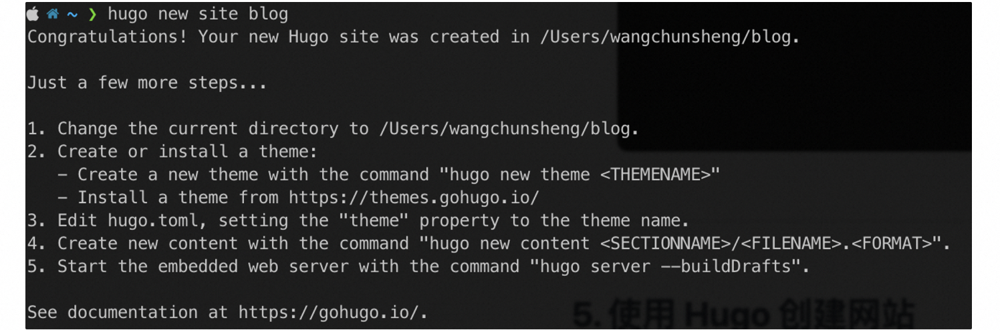
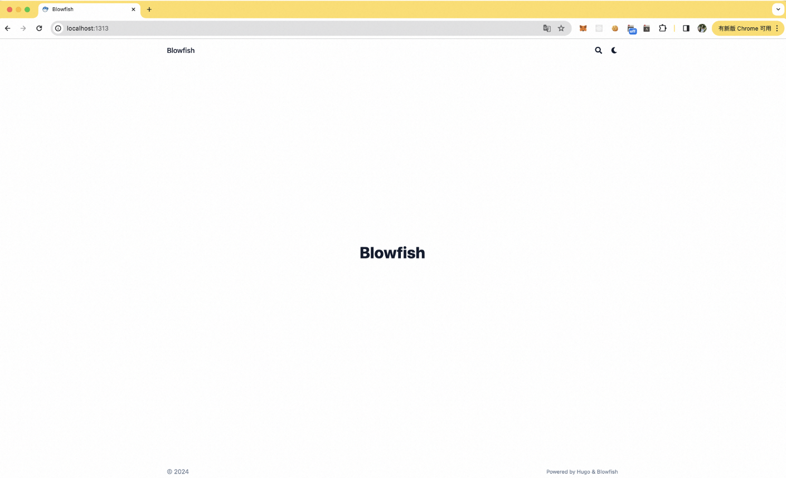
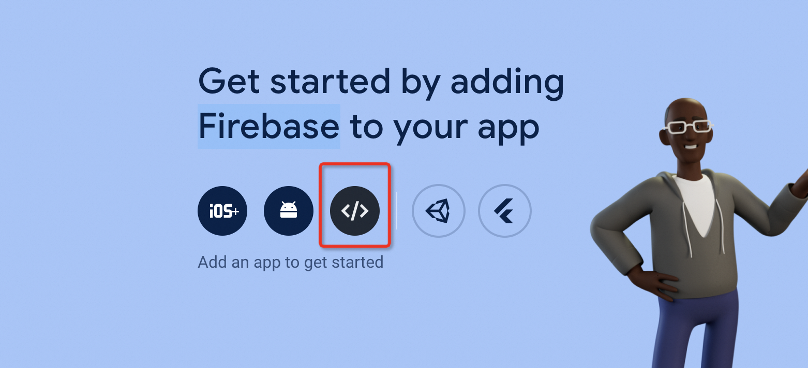
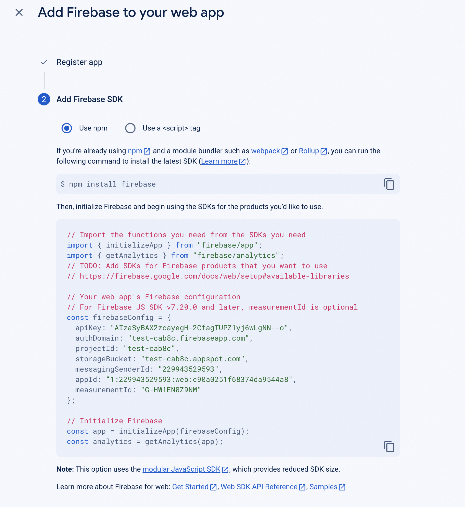
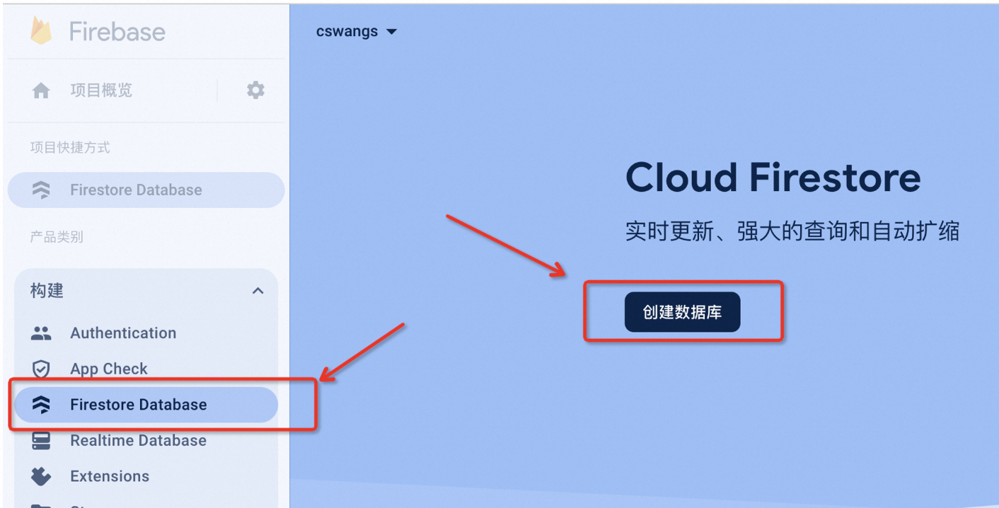
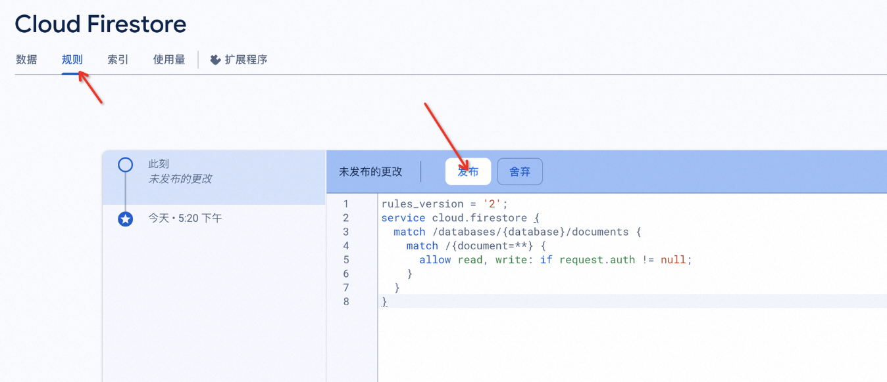
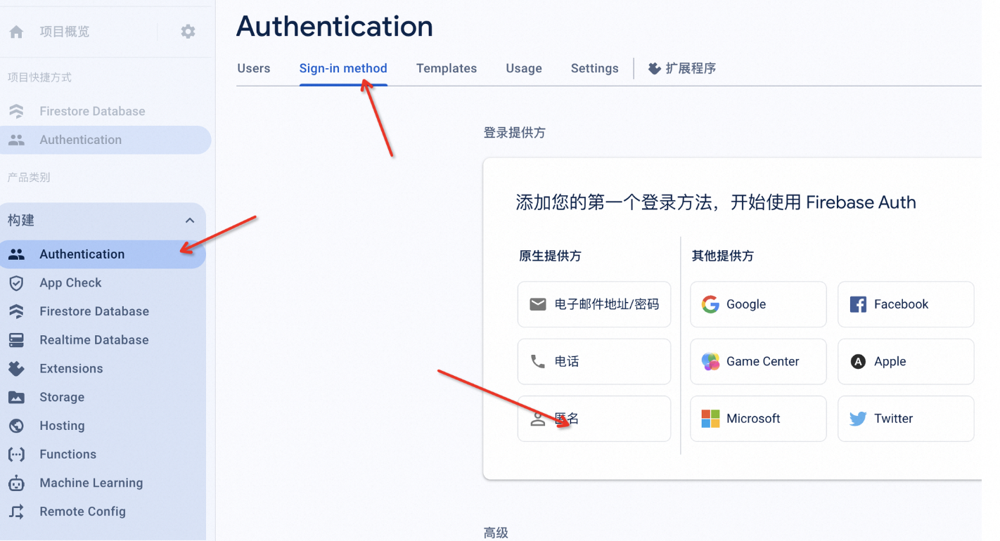

## 1. 安装 Hugo

1. 这里使用包管理器安装 Hugo，我的操作系统是 Mac OS，所以使用 Homebrew 安装 Hugo。如果你使用的是 Windows 或 Linux，可以根据 Hugo 文档提示的方式安装：[ Hugo 文档：Install Hugo](https://gohugo.io/getting-started/installing/)

   ```shell
   brew install hugo
   ```
2. 查看 Hugo 是否安装成功，显示 Hugo 版本号代表 Hugo 安装成功。

   ```shell
   hugo version
   ```

## 2. hugo创建网站

```bash
# 创建网站
hugo new site blog
```



```bash
# 进入bolg目录
cd blog
# 初始化本地git仓库
git init
# 添加主题git子模块 
git submodule add -b main https://github.com/nunocoracao/blowfish.git themes/blowfish
# 创建并拷贝默认配置
mkdir -p config/_default && cp themes/blowfish/config/_default/* ./config/_default
# 配置主题
sed -i "" 's/# theme/theme/g' config/_default/config.toml
# 创建.gitignore 并初始化
echo ".hugo_build.lock\npublic/\nresources/_gen/\n.DS_Store" >> gitignore
# 启动
hugo server
```

本地浏览器查看服务，打开网址

**[http://localhost:1313](http://localhost:1313/)**



至此本地博客的搭建就完成了

## 3. 推送博客到github page

### 3.1 github 创建仓库

创建两个仓库 `blog` 和 `cswangs.github.io` 注意cswangs改成自己的github用户名

其中

`blog` 仓库用来存储博客源码文件等

`cswangs.github.io` 仓库用来存储打包好的网站文件

### 3.2 推送 blog 到仓库

```bash
# 在blog目录下执行如下命令
git add .
git commit -m "blog init"
git remote add origin https://github.com/cswangs/blog.git
git branch -M master
git push -u origin master
```

### 3.3 本地生成打包目录

```bash
#在blog目录下执行该命令生成public文件夹
hugo
```

### 3.4 推送 public 到仓库

```bash
cd public
git init
git remote add origin git@github.com:cswangs/cswangs.github.io.git
git pull --rebase origin master
git add .
git commit -m "init blog"
git push origin master
```

### 3.5 查看网页

`注意 cswangs 换成自己的 github username`

**[https://cswangs.github.io/](https://cswangs.github.io/)**

## 4. 基本配置和创作

### 4.1 基本配置

以上最基础的blog就搭建完毕了，可以根据自己的喜好进行自定义配置

配置说明可查看 **[blowfish相关文档](https://blowfish.page/docs/getting-started/#basic-configuration)**

如果觉得太复杂，可以直接 copy [我的](https://github.com/cswangs/blog)或者其他大佬的配置文件

可以 copy 除了 public 和 themes 的所有**文件夹**

然后再根据自己的偏好进行调整

其中主要修改如下几个文件

- config/_default/languages.zh-cn.toml
- static

修改建议：

图片可以使用[https://favicon.io/](https://favicon.io/)

在线生成定制化的icon 或者将自己的照片转换到响应格式

[https://www.reduceimages.com/](https://www.reduceimages.com/)  也可以使用该网址，进行单张图片的格式调整

### 4.2 创作

创作主要在 `content`文件夹中进行，可以直接在blog文件夹中进行复制修改

也可以使用命令直接创建，用 Hugo 创建一篇文章的命令是:

```shell
hugo new content/blog/first-blog/index.md
```

用这个命令创建的 Markdown 文件会套用 `archetypes` 文件夹中的 front matter 模版，在空白处用 Markdown 写入内容。

### 4.3 发布

```bash
#在blog目录下执行该命令更新public文件夹
hugo
cd public
git add .
git commit -m "first blog"
git push origin master
```

ps: 在发布之前可以执行 `hugo server` 命令在本地进行验证

## 5. 其他配置

### 5.1 评论

评论使用的是cusdis  `https://cusdis.com/`

修改 `layouts/partials/comments.html` 文件中的配置data-app-id 为自己的 data-app-id

### 5.2 view&like

浏览量和点赞使用的是 `https://console.firebase.google.com/`

参考文档 **https://blowfish.page/docs/firebase-views/**

1. Create a web app

   
2. 获取firebase SDK 配置，并修改到config/_default/params.toml配置文件

   
3. Create a new database and choose to start in production mode.



2. 配置规则

```
rules_version = '2';
service cloud.firestore {
  match /databases/{database}/documents {
    match /{document=**} {
      allow read, write: if request.auth != null;
    }
  }
}
```

3. 发布



4. 允许匿名



## 6. Reference

[如何用 GitHub Pages + Hugo 搭建个人博客](https://miawithcode.com/blog/how-to-build-a-personal-blog-using-github-pages-and-hugo)

[blowfish 主题](https://blowfish.page/)

[hugo quick start](https://gohugo.io/getting-started/quick-start/)

[cusdis 评论系统](https://cusdis.com/)

[google 浏览量和点赞](https://console.firebase.google.com/)
