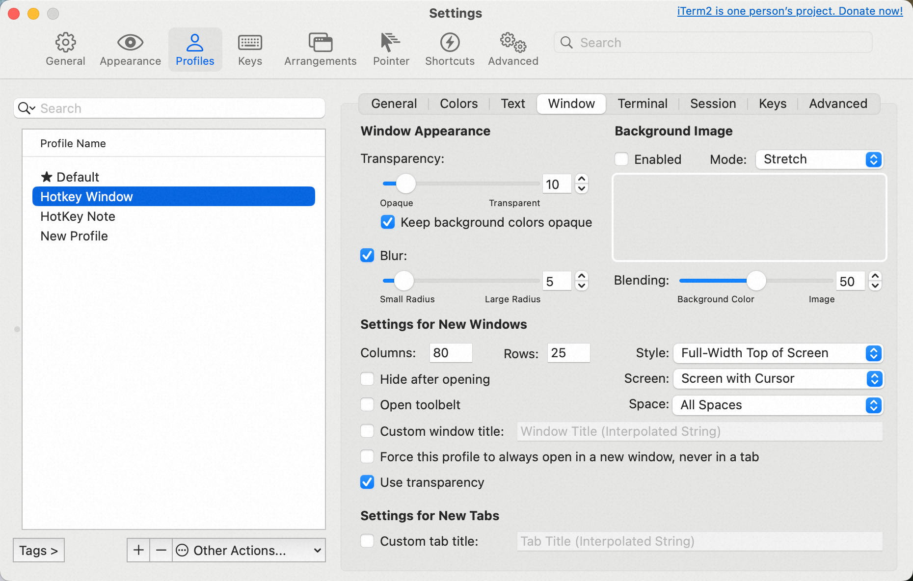
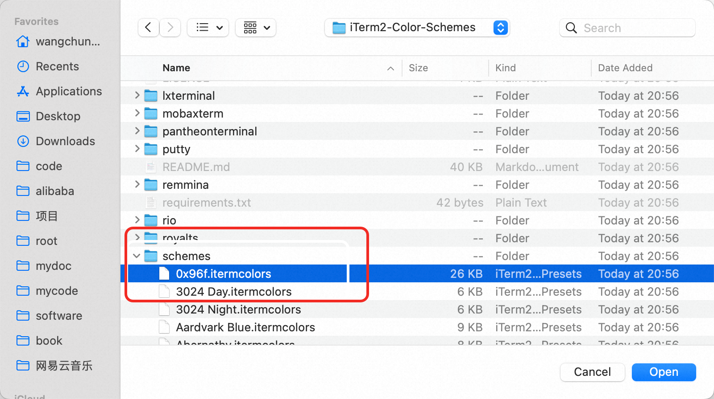
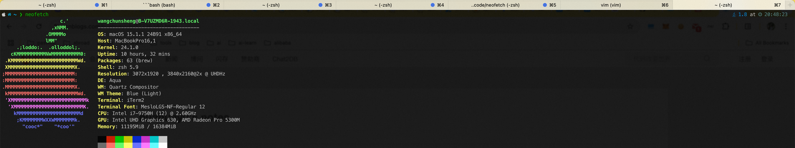
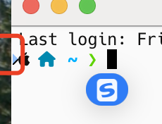
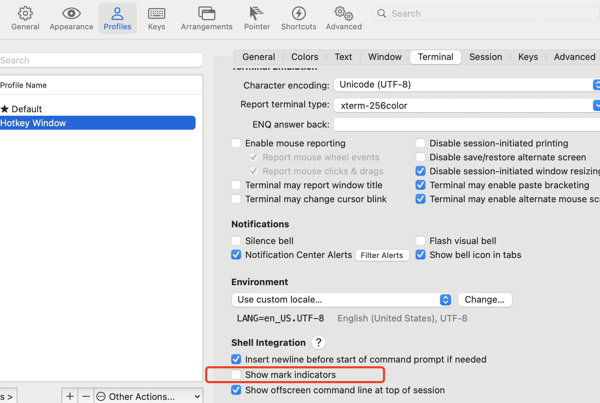
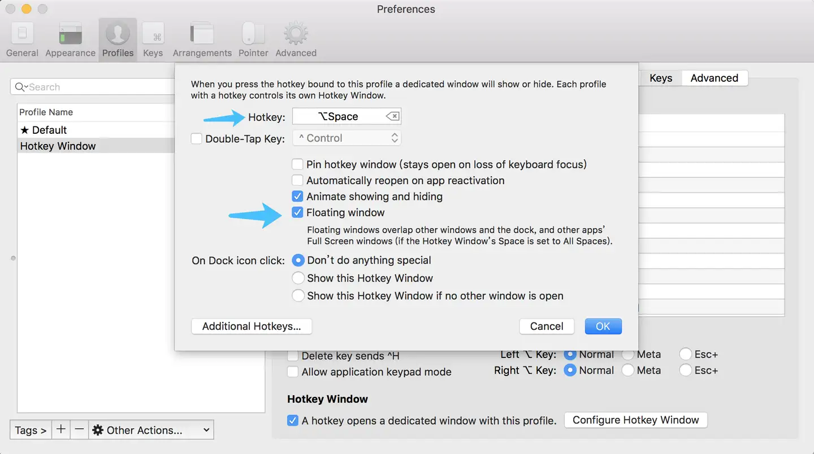

## 1. 安装 iTerm2

1. 从官网下载并安装 [iTerm2](https://iterm2.com/)，或使用 Homebrew 安装：

   ```shell
   brew install --cask iterm2
   ```

## 2. 安装 oh my zsh

1. Mac 系统默认已经安装了 zsh，可以通过以下命令确认：

   ```shell
   zsh --version
   ```

2. 安装 oh my zsh：

   ```shell
   sh -c "$(curl -fsSL https://raw.githubusercontent.com/ohmyzsh/ohmyzsh/master/tools/install.sh)"
   ```

## 3. 配置主题

### 3.1 安装 Powerlevel10k 主题

```bash
git clone --depth=1 https://github.com/romkatv/powerlevel10k.git ${ZSH_CUSTOM:-$HOME/.oh-my-zsh/custom}/themes/powerlevel10k
```

修改 `~/.zshrc` 文件中的主题配置：

```bash
ZSH_THEME="powerlevel10k/powerlevel10k"
```

重新加载配置：

```bash
source ~/.zshrc
```

首次加载会进入主题配置向导，根据个人喜好进行配置即可。如需重新配置，可执行：

```bash
p10k configure
```

这里配置时注意，第一个选项是否安装字体可能会失败！！！可以先**选择不安装**

### 3.2 安装字体

为了正确显示主题的特殊字符，需要安装 Nerd Font：

```bash
brew install --cask font-hack-nerd-font
```

在 iTerm2 中设置字体：
Preferences → Profiles → Text → Font → 选择 Hack Nerd Font

## 4. 安装插件

### 4.1 语法高亮插件

```bash
git clone https://github.com/zsh-users/zsh-syntax-highlighting.git ${ZSH_CUSTOM:-~/.oh-my-zsh/custom}/plugins/zsh-syntax-highlighting
```

### 4.2 自动补全插件

```bash
git clone https://github.com/zsh-users/zsh-autosuggestions ${ZSH_CUSTOM:-~/.oh-my-zsh/custom}/plugins/zsh-autosuggestions
```

### 4.3 autojump 安装

```bash
brew install autojump
```

### 4.3 启用插件

编辑 `~/.zshrc` 文件，找到 plugins 配置行：

```bash
plugins=(
    git
    zsh-syntax-highlighting
    zsh-autosuggestions
)
```

重新加载配置：

```bash
source ~/.zshrc
```

## 5. iTerm2 常用配置

### 5.1 配置快捷键

1. 设置热键显示终端：
   Preferences → Keys → Hotkey → Create a Dedicated Hotkey Window
   热键终端配置推荐：

   
2. 配置分屏快捷键：

   - 垂直分屏：Command + D
   - 水平分屏：Command + Shift + D
   - 切换分屏：Command + Option + 方向键

### 5.2 配置配色方案

1. 下载配色方案:

```bash
git clone https://github.com/mbadolato/iTerm2-Color-Schemes.git
```

2. 导入配色方案:

   Preferences → Profiles → Colors → Color Presets → Import

   

推荐配色方案：Solarized Dark、Dracula、One Dark

### 5.3 其他实用设置

1. 设置透明度：
   Preferences → Profiles → Window → Transparency
2. 设置模糊效果：
   Preferences → Profiles → Window → Blur
3. 关闭提示音：
   Preferences → Profiles → Terminal → Notifications → Silence bell
4. 关闭**Enable Mouse Reporting（鼠标报告)(这个会开启影响在vim中的复制)**Preferences → Profiles → Terminal →**Enable Mouse Reporting**

## 6. `.zshrc` 文件配置

编辑 `~/.zshrc` 文件，添加常用命令别名，环境变量等配置（以下是推荐配置）：

```bash
# === 常用别名配置 ===
# 文件操作
alias l.='ls -d .*'
alias ll='ls -lA'
alias l='ls -F'
alias mv='mv -i'  # 防止误操作，移动文件时提示
alias cp='cp -i'  # 防止误操作，复制文件时提示
alias rm='rm -i'  # 防止误操作，删除文件时提示

# 目录导航
alias cl='clear'
alias ..='cd ..'
alias ...='cd ../..'
alias ~='cd ~'
alias -- -='cd -'  # 返回上一次的目录

# Git 相关
alias gs='git status'
alias ga='git add'
alias gc='git commit -m'
alias gp='git push'
alias gl='git pull'

# === 环境变量配置 ===
# 配置 PATH（使用 ~ 代替完整家目录路径）
export PATH="/usr/local/opt/mongodb-community@4.4/bin:$PATH"
export PATH="~/software/groovy-3.0.14/bin:$PATH"
export PATH="~/.nvm/versions/node/v19.8.1/bin:$PATH"
export PATH="/Applications/CMake.app/Contents/bin:$PATH"
export PATH="~/miniforge3/bin:$PATH"

# Hugging Face 镜像
export HF_ENDPOINT=https://hf-mirror.com

# === 按需加载功能 ===
# nvm 手动加载（提升终端启动速度）
function load_nvm {
    export NVM_DIR="$HOME/.nvm"
    [ -s "$NVM_DIR/nvm.sh" ] && \. "$NVM_DIR/nvm.sh"
    [ -s "$NVM_DIR/bash_completion" ] && \. "$NVM_DIR/bash_completion"
}
alias nvmload='load_nvm'

# conda 手动加载（提升终端启动速度）
function load_conda {
    eval "$(~/miniforge3/bin/conda shell.bash hook)"
}
alias condaload='load_conda'

# === oh-my-zsh 配置 ===
# 插件配置（注意：conda 插件会自动加载 conda 环境，可能导致启动变慢）
plugins=(
    git             # Git 命令缩写
    autojump        # 快速目录跳转
    mvn             # Maven 命令补全
    macos           # macOS 特定命令
    gradle          # Gradle 命令补全
    docker          # Docker 命令补全
    docker-compose  # Docker Compose 命令补全
    cp              # cp 命令进度条
    pip             # pip 命令补全
    node            # Node.js 相关
    zsh-autosuggestions      # 命令自动补全
    zsh-syntax-highlighting  # 命令语法高亮
)

# Powerlevel10k 主题配置
if [[ -r "${XDG_CACHE_HOME:-$HOME/.cache}/p10k-instant-prompt-${(%):-%n}.zsh" ]]; then
    source "${XDG_CACHE_HOME:-$HOME/.cache}/p10k-instant-prompt-${(%):-%n}.zsh"
fi
ZSH_THEME="powerlevel10k/powerlevel10k"
[[ ! -f ~/.p10k.zsh ]] || source ~/.p10k.zsh

# oh-my-zsh 核心加载
export ZSH=$HOME/.oh-my-zsh
source $ZSH/oh-my-zsh.sh
```

## 7. 效果展示



## 8. 参考资料

- [iTerm2 官网](https://iterm2.com/)
- [Oh My Zsh 官网](https://ohmyz.sh/)
- [Powerlevel10k](https://github.com/romkatv/powerlevel10k)
- [Nerd Fonts](https://www.nerdfonts.com/)
- [zsh-syntax-highlighting](https://github.com/zsh-users/zsh-syntax-highlighting)
- [zsh-autosuggestions](https://github.com/zsh-users/zsh-autosuggestions)

## 9. 常见问题解决

### 9.1 终端启动速度慢

1. 使用按需加载：将 nvm、conda 等环境配置改为手动加载
2. 减少不必要的插件：只保留常用的 oh-my-zsh 插件
3. 使用 `zprof` 分析启动性能：

   ```bash
   # 在 .zshrc 文件最开始添加
   zmodload zsh/zprof
   # 在 .zshrc 文件最后添加
   zprof
   ```

### 9.2 字体显示异常

1. 确保正确安装了 Nerd Font
2. 在 iTerm2 中设置字体时选择带有 "Nerd Font" 后缀的字体
3. 重启 iTerm2 使字体设置生效

### 9.3 复制粘贴问题

1. 确保关闭了 Mouse Reporting 功能
2. 使用 Command + C/V 进行复制粘贴
3. 在 vim 中使用 visual 模式时，按住 Option 键进行选择复制

### 9.4 终端左侧有小三角




1. 取消勾选 `show mark indicators`

### 9.5 iterm2 HotKey window 无法再任意界面弹出展示

iterm2 热键无法再任意界面展示，比如在全屏chrome时，按快捷键会跳出chrome

1. `HotKey Window` -> `Advanced` -> `Configure HotKey Window` -> `Floating Window`
2. 勾选floating window


## 10. 其他

### vim 推荐配置

修改 .vimrc 文件

```bash
" Configuration file for vim
set modelines=0


" Normally we use vim-extensions. If you want true vi-compatibility
" remove change the following statements
set nocompatible
 " Use Vim defaults instead of 100% vi compatibility
set backspace=2
" more powerful backspacing


" Don't write backup file if vim is being called by "crontab -e"
au BufWrite /private/tmp/crontab.* set nowritebackup nobackup
" Don't write backup file if vim is being called by "chpass"
au BufWrite /private/etc/pw.* set nowritebackup nobackup


syntax on
" 语法高亮
autocmd InsertLeave * se nocul
autocmd InsertEnter * se cul
" 用浅色高亮当前行
set tabstop=4
" Tab键的宽度
set softtabstop=4
set shiftwidth=4
"  统一缩进为4
" 鼠标定位光标
set mouse=a
" set number
" 显示行号
colorscheme pablo
" 设置颜色主题
set ruler
" 在编辑过程中，在右下角显示光标位置的状态行
set scrolloff=3
" 光标移动到buffer的顶部和底部时保持3行距离

" Plugin 'ybian/smartim'

```

### git alias 配置推荐（展示更丰富的分支commit信息）

```bash
git config --global alias.last 'log -1 HEAD'
git config --global alias.logg 'log --graph --decorate --oneline --simplify-by-decoration --all'
git config --global alias.cfgls 'config --lis'
git config --global alias.lg 'log --graph --decorate --oneline --all'
git config --global alias.caa 'commit -a --amend'
git config --global alias.st 'status'
git config --global alias.l "log --color --graph --pretty=format:'%Cred%h%Creset -%C(yellow)%d%Creset %s %Cgreen(%cr) %C(bold blue)<%an>%Creset' --abbrev-commit  --decorate  --all"
```
